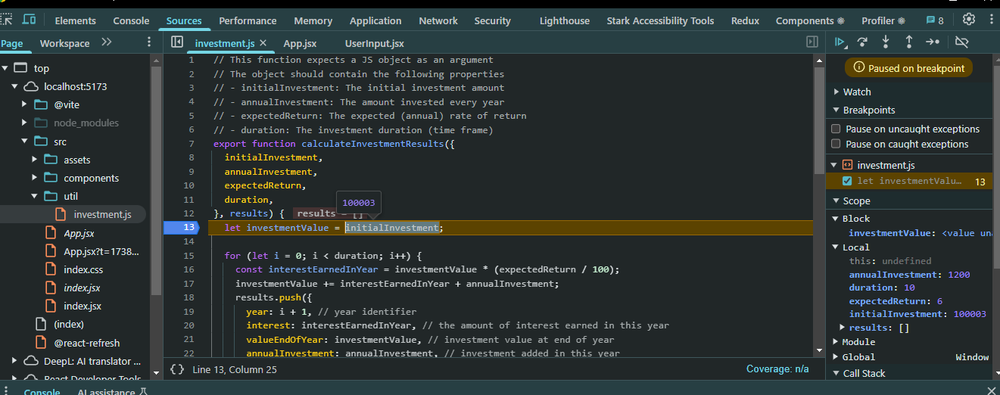

# Debugging di React

Debugging adalah proses untuk menemukan dan memperbaiki bug dalam aplikasi React.
Berikut adalah beberapa teknik debugging yang dapat digunakan:

## 1. Understanding React Error Messages

Saat terjadi error dalam React, pesan error biasanya muncul di **Console** browser.
Pesan ini sangat membantu karena biasanya mencakup:

- **Jenis error** (misalnya, "TypeError", "ReferenceError").
- **File dan baris kode** tempat error terjadi.
- **Stack trace** yang menunjukkan bagaimana kode berjalan hingga terjadi error.

> # 

### Cara membaca pesan error:

1. Periksa **judul error** untuk mengetahui jenis masalah.
2. Lihat **file dan baris kode** untuk menemukan sumber error.
3. Gunakan **stack trace** untuk memahami bagaimana error terjadi.

## 2. Using Browser Debugger

Browser memiliki debugger yang bisa membantu melacak eksekusi kode dan melihat nilai
variabel.

> # 

### Langkah-langkah menggunakan debugger di browser:

1. **Buka DevTools** dengan menekan `F12` atau `Ctrl + Shift + I` (Windows/Linux)
   atau `Cmd + Opt + I` (Mac).
2. Navigasikan ke tab **Sources**.
3. Temukan file JavaScript yang ingin diperiksa di **file navigator**.
4. Tambahkan **breakpoint** dengan mengklik nomor baris kode di file yang sedang
   dibuka.
5. Jalankan ulang aplikasi dan debugger akan berhenti di breakpoint yang ditentukan.
6. Gunakan tombol **Step Over**, **Step Into**, atau **Step Out** untuk menjalankan
   kode satu per satu.
7. Periksa **Call Stack**, **Scope**, dan **Watch** untuk melihat variabel yang
   sedang digunakan.

## 3. Strict Mode

Strict Mode adalah fitur di React yang membantu menemukan potensi bug dalam aplikasi
dengan memberikan peringatan tambahan selama pengembangan.

### Cara mengaktifkan Strict Mode:

Tambahkan `<React.StrictMode>` di file `index.js`:

```jsx
import React from 'react';
import ReactDOM from 'react-dom/client';
import App from './App';

const root = ReactDOM.createRoot(document.getElementById('root'));
root.render(
  <React.StrictMode>
    <App />
  </React.StrictMode>
);
```

> **Strict Mode hanya berlaku di pengembangan dan tidak mempengaruhi produksi.**

## 4. Using React DevTools Extension

React Developer Tools adalah ekstensi browser yang memungkinkan kita:

- **Memeriksa komponen React** secara real-time.
- **Melihat state dan props** setiap komponen.
- **Memeriksa performance rendering**.

>  

### Cara menggunakan React DevTools:

1. **Instal ekstensi** dari Chrome Web Store atau Firefox Add-ons.
2. Buka **DevTools** (`F12` atau `Ctrl + Shift + I`).
3. Navigasi ke tab **Components** untuk melihat struktur komponen.
4. Pilih komponen untuk melihat **state dan props**.
5. Gunakan tab **Profiler** untuk menganalisis performa aplikasi.
