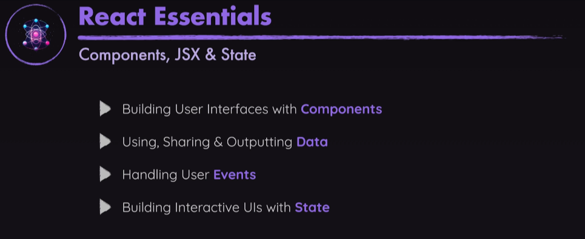
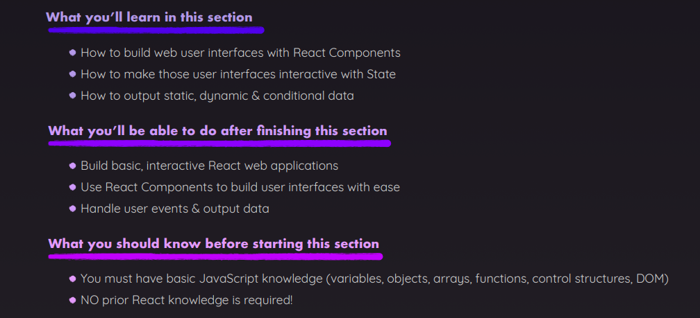

# React Essentials - Components, JSX, Props, State & More

 

## Note

- ## Cara Menentukan Kapan Sebuah File Harus Dipisah

1. **Pisahkan Setiap Bagian Fitur**  
   Setiap fitur yang memiliki logika sendiri atau bisa digunakan ulang sebaiknya
   dipisahkan. Contoh:

   - **Form Input** → Bisa dibuat sebagai komponen `<Input />` agar lebih reusable.
   - **Tombol** → Jika sering digunakan dengan variasi yang berbeda, bisa dibuat
     sebagai `<Button />`.

2. **Prinsip Single Responsibility (SRP)**  
   Setiap komponen harus memiliki satu tanggung jawab utama. Jika sebuah file sudah
   terlalu banyak tugas, pertimbangkan untuk memecahnya. Contoh:

   - **Komponen besar dengan banyak fungsi?** → Pisahkan berdasarkan fungsinya.
   - **Terlalu banyak `useState`, `useEffect`?** → Mungkin butuh custom hooks atau
     sub-komponen.

3. **Reusability & DRY (Don't Repeat Yourself)**  
   Jika ada bagian kode yang digunakan di beberapa tempat, buatlah menjadi komponen
   tersendiri. Contoh:

   - **Card** untuk tampilan data.
   - **List item** yang sama di beberapa halaman.
   - **Modal** yang digunakan berulang kali.

4. **Struktur Hierarki Komponen yang Jelas**  
   Gunakan pola **Presentational vs. Container Components**:

   - **Presentational (UI Components)** → Hanya fokus pada tampilan. Contoh:
     `Button`, `Card`, `Avatar`.
   - **Container (Logic Components)** → Mengurus state dan logika bisnis. Contoh:
     `ProductList`, `UserProfileContainer`.

5. **Jika Komponen Terlalu Panjang (> 250–300 Baris)**  
   Jika satu file komponen sudah terlalu panjang dan sulit dibaca, pertimbangkan
   untuk memecahnya. Misalnya:

   - Pisahkan bagian **form** ke dalam `FormComponent.js`.
   - Pisahkan **list item** ke dalam `ItemComponent.js`.

6. **State Management & Props Drilling**  
   Jika terlalu banyak **props drilling** (mengoper props dari parent ke child
   terlalu dalam), pertimbangkan:

   - Menggunakan **Context API**.
   - Memecah komponen agar lebih modular.
   - Menggunakan **state management** seperti Redux atau Zustand.

7. **Performance Optimization**  
   Jika suatu bagian sering berubah dan menyebabkan **re-render** yang tidak perlu,
   mungkin perlu dipisah agar optimalisasi lebih mudah dengan:
   - **React.memo**
   - **useMemo**
   - **useCallback**

- ## Cara mengirim props
