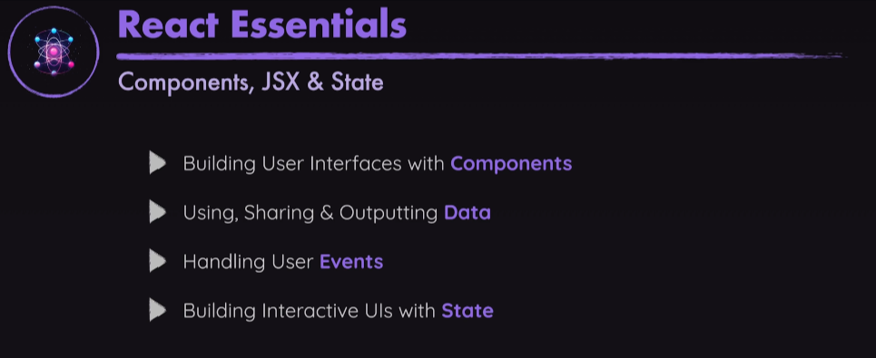
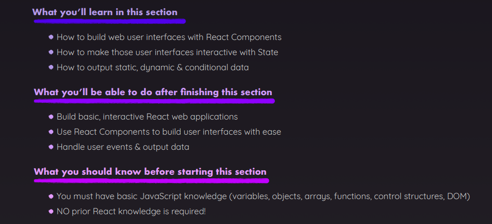
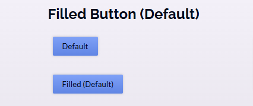
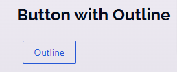
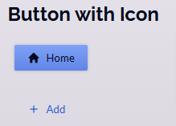

# React Essentials - Components, JSX, Props, State & More




## Note

### Cara Menentukan Kapan Sebuah File Harus Dipisah

1. **Pisahkan Setiap Bagian Fitur**  
   Setiap fitur yang memiliki logika sendiri atau bisa digunakan ulang sebaiknya
   dipisahkan. Contoh:

   - **Form Input** → Bisa dibuat sebagai komponen `<Input />` agar lebih reusable.
   - **Tombol** → Jika sering digunakan dengan variasi yang berbeda, bisa dibuat
     sebagai `<Button />`.

2. **Prinsip Single Responsibility (SRP)**  
   Setiap komponen harus memiliki satu tanggung jawab utama. Jika sebuah file sudah
   terlalu banyak tugas, pertimbangkan untuk memecahnya. Contoh:

   - **Komponen besar dengan banyak fungsi?** → Pisahkan berdasarkan fungsinya.
   - **Terlalu banyak `useState`, `useEffect`?** → Mungkin butuh custom hooks atau
     sub-komponen.

3. **Reusability & DRY (Don't Repeat Yourself)**  
   Jika ada bagian kode yang digunakan di beberapa tempat, buatlah menjadi komponen
   tersendiri. Contoh:

   - **Card** untuk tampilan data.
   - **List item** yang sama di beberapa halaman.
   - **Modal** yang digunakan berulang kali.

4. **Struktur Hierarki Komponen yang Jelas**  
   Gunakan pola **Presentational vs. Container Components**:

   - **Presentational (UI Components)** → Hanya fokus pada tampilan. Contoh:
     `Button`, `Card`, `Avatar`.
   - **Container (Logic Components)** → Mengurus state dan logika bisnis. Contoh:
     `ProductList`, `UserProfileContainer`.

5. **Jika Komponen Terlalu Panjang (> 250–300 Baris)**  
   Jika satu file komponen sudah terlalu panjang dan sulit dibaca, pertimbangkan
   untuk memecahnya. Misalnya:

   - Pisahkan bagian **form** ke dalam `FormComponent.js`.
   - Pisahkan **list item** ke dalam `ItemComponent.js`.

6. **State Management & Props Drilling**  
   Jika terlalu banyak **props drilling** (mengoper props dari parent ke child
   terlalu dalam), pertimbangkan:

   - Menggunakan **Context API**.
   - Memecah komponen agar lebih modular.
   - Menggunakan **state management** seperti Redux atau Zustand.

7. **Performance Optimization**  
   Jika suatu bagian sering berubah dan menyebabkan **re-render** yang tidak perlu,
   mungkin perlu dipisah agar optimalisasi lebih mudah dengan:
   - **React.memo**
   - **useMemo**
   - **useCallback**

---

### Props: Cara Passing, Default Props, dan Forward Props `{...props}`

#### **Cara Passing Props**

Selain cara biasa untuk menetapkan dan mengambil props, ada beberapa metode tambahan
yang bisa digunakan untuk mengelola props lebih efisien.

##### **Passing a Single Prop Object**

Jika data sudah terstruktur sebagai objek JavaScript, kita bisa meneruskannya sebagai
satu nilai props daripada membaginya menjadi beberapa props.

```jsx
<CoreConcept
  title={CORE_CONCEPTS[0].title}
  description={CORE_CONCEPTS[0].description}
  image={CORE_CONCEPTS[0].image} />

// Atau dengan spread operator:
<CoreConcept {...CORE_CONCEPTS[0]} />

// Atau bisa juga seperti ini:
<CoreConcept concept={CORE_CONCEPTS[0]} />
```

Di dalam komponen `CoreConcept`, kita bisa mengaksesnya seperti ini:

```jsx
export default function CoreConcept({ concept }) {
  // Gunakan concept.title, concept.description, dll.
  // Atau destrukturisasi objek: const { title, description, image } = concept;
}
```

##### **Grouping Received Props Into a Single Object**

Kita juga bisa mengelompokkan beberapa props ke dalam satu objek dengan "Rest
Property" syntax:

```jsx
export default function CoreConcept({ ...concept }) {
  // ...concept mengelompokkan beberapa nilai menjadi satu objek
  // Gunakan concept.title, concept.description, dll.
}
```

#### **Default Prop Values**

Terkadang, komponen bisa memiliki props opsional. Misalnya, komponen `Button` dengan
prop `type`:

```jsx
<Button type="submit" caption="My Button" />
<Button caption="My Button" />
```

Untuk menetapkan nilai default jika prop tidak diberikan, kita bisa menggunakan
default values dalam object destructuring:

```jsx
export default function Button({ caption, type = 'submit' }) {
  // caption tidak memiliki default value, type memiliki default "submit"
}
```

#### **Contoh Button dengan Props & Forward Props**

Berikut contoh kode lengkap untuk komponen `Button`:

```jsx
export default function Button({ children, mode = 'filled', Icon, ...props }) {
  let cssClasses = `button ${mode}-button`;

  if (Icon) {
    cssClasses += ' icon-button';
  }

  return (
    <button className={cssClasses} {...props}>
      {Icon && (
        <span className="button-icon">
          <Icon />
        </span>
      )}
      <span>{children}</span>
    </button>
  );
}
```

Dan berikut contoh penggunaannya:

```jsx
<section>
  <h2>Filled Button (Default)</h2>
  <Button>Default</Button>
  <Button mode="filled">Filled (Default)</Button>
</section>
```



```jsx
<section>
  <h2>Button with Outline</h2>
  <Button mode="outline">Outline</Button>
</section>
```



```jsx
<section>
  <h2>Text-only Button</h2>
  <Button mode="text">Text</Button>
</section>
```


```jsx
<section>
  <h2>Button with Icon</h2>
  <Button Icon={HomeIcon}>Home</Button>
  <Button Icon={PlusIcon} mode="text">
    Add
  </Button>
</section>
```



```jsx
<section>
  <h2>Buttons Should Support Any Props</h2>
  <Button mode="filled" disabled>
    Disabled
  </Button>
  <Button onClick={() => console.log('Clicked!')}>Click me</Button>
</section>
```


